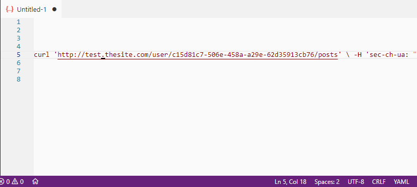

# Regex Based Selection

This extensions allows you to quickly select text based on a regular expression at the cursor position. Useful for those oddball but frequent selections that are too quirky for other tools to work.

You can create an unlimited list of regular expressions and then pick one from the list or assign shortcuts to them.

## Usage

Before using, the regular expressions need to be added in `Settings` > `Regex Based Selection: Regex List`.

The format for the expressions is `name: regex`. For example: `numbers: [0-9]+`

**Expressions that match the empty string are not allowed**.

To activate the extension, position your cursor where you want and `Ctrl+Shift+P` and choose either:

| Command                                    | Use                                                                   |
| ------------------------------------------ | --------------------------------------------------------------------- |
| `Regex Based Selection: Pick From List`    | Pick an expression from a list of user defined regexes.               |
| `Regex Based Selection: Use Regex #1 - #5` | Select text based on rules #1 through #5 on the user defined regexes. |
| `Regex Based Selection: Use Last Used`     | Reuse the last expression.                                            |

These three commands can be bound to shortcuts, which the extension does not do by default so as to not introduce possible conflicts.

## Known Issues/Limitations

There is no way to rename the title for commands like `Regex Based Selection: Use Regex #1`. You'll have to get used to remembering what each entry does (or use the Pick From List command). The VSCode team does not like the idea of allowing extensions to programmatically change it (https://github.com/microsoft/vscode/issues/34048), so this is unlikely to change in the foreseeable future. 

You can change the titles manually if you are so inclined.

To do this, navigate to the extensions folder on your VSCode installation (typically _~/.vscode/extensions/regex-based-selection_ in Linux or _%USERPROFILE%\.vscode\extensions\regex-based-selection_ in Windows) and find the file _package.json_. Navigate to the _contributions_ entry and change the name by hand.

Cumbersome... but c'est la vie.

The extension is intended for short, single line selections. It dos not support multiline.

## Release Notes

### 1.0.0

Initial release.

